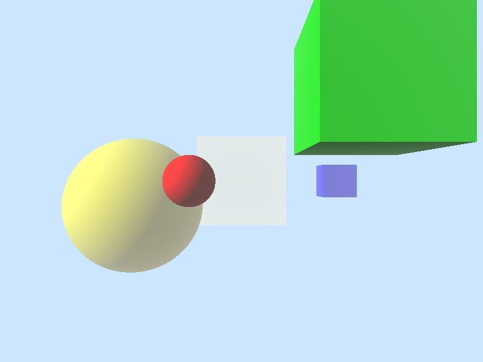

# RendeRays raytracer
  

## Table of contents
* [General info](#general-info)
* [Technologies](#technologies)
* [Usage](#usage)
	* [Usage example](#usage-example)
	* [For developers](#for-developers)
* [Scene file description](#scene-file-description)
	* [Name](#name)
	* [Output image size](#output-image-size)
	* [Background color](#background-color)
	* [Cameras](#cameras)
	* [Light source](#light-source)
	* [Fog](#fog)
	* [Objects to render](#objects-to-render)
* [TODOs](#todos)
* [Author](#author)
### General info
RendeRays is an application that is used for rendering static images of a geometric scene using ray-tracing technique. 
Applicable for rendering studies and computer vision applications as a source for test images.
### Technologies
*RendeRays* is developed in C++ and compiled with C++17 compatable compiler.
The application is tested with Visual Studio 2019, however, any C++17 compiler should work.  
Images are saved as *.ppm* file.
### Usage
To use *RendeRays* application, launch executable file and provide command line arguments to specify
file name of a scene to be rendered *(option -f)* and whether rendered image should be immediately displayed *(option -s)*.
Scene description file should be present in *'/scenes'* folder.
Rendered output images are placed in *'/output'* folder.
#### Usage example
To start rendering the scene described in 'scene/test_scene.json' file and display images immediately after each render, write:
> RendeRays.exe -f test_scene.json -s
#### For developers
In Visual Studio: after cloning the repo go to *'Project properties'* and select *'Debugging'* section:  
- Add *'Command arguments'* as described above.
- Set *'Working directory'* to location of the application .exe file.
### Scene file description
Scenes are described in *.json* files with the following pseudo-structure:
```javascript
{
	"name": "scene name"
	"output_size": [ width, height ],
	"background": [ red, green, blue ],
	"cameras": [
		...
	],
	"light": {
		...
	},
	"fog": {
		...
	},
	"renderables": [
		...
	]
}
```  
Each of the items are described below.
#### Name
Identifies the scene. Is used to construct output file names.
```javascript
"name": "scene name"
```  
#### Output image size
Describes the size of the output image in pixels.
```javascript
"output_size": [ 800, 600 ]
```  
#### Background color
Describes the color of the scenes background. Colors are defined as *r,g,b* components in the range of *0.0 - 1.0*.
```javascript
"background": [ 0.3, 1.0, 0.0 ]
```  
#### Cameras
Cameras define the vantage points of the scene; there can be more than one camera described! In that case 
scene is rendered for each camera *one-by-one* and saved in separate image files.  
- *'type'* property defines the type of the camera. Currently only *'perspective'* camera is supported.  
- *'fov'* property defines horizontal field-of-view of the camera and is defined in degrees.  
- *'translation'* describes the position of the camera in 3d space. Right-hand coordinate system is used
with the *y* axis going up.  
- *'rotation_y'* describes camera rotation about *y* axis in degrees.  

The following camera description will produce two images from two different vantage points:  
```javascript
"cameras": [
	{
		"type": "perspective",
		"fov": 60.0,
		"translation": [ 0.0, 0.0, 5.0 ],
		"rotation_y": 0.0
	},
	{
		"type": "perspective",
		"fov": 60.0,
		"translation": [ 5.0, 0.0, 0.0 ],
		"rotation_y": 90.0
	}
]
```  
#### Light source
Light describes the shading parameters of the scene objects. Currently there can only be one light source per scene. 
Phong shading model is used to calculate shading values for each point on the object surface.  
There are two lighting types currently supported:  
- Ambeint
- Directional  

Ambient light is a light that doesnt have any particular source and direction but exists uniformly in space. Ambient color 
value describes the ambient light.  
Directional light, however, is described by it's direction and diffuse color. In real-world analogies directional light can be seen
as a sunshine on the Earth. Phong shading model requires us to define ambient light color as well. In this case ambient light can
be imagined as a *global illumination* of the scene.  
To describe ambient light:
```javascript
"light": {
	"type": "ambient",
	"ambient": [ 1.0, 1.0, 1.0 ]
}
```  
To describe directional light:  
```javascript
"light": {
	"type": "directional",
	"direction": [ 1.5, -1.0, -1.0 ],
	"diffuse": [ 1.0, 1.0, 1.0 ],
	"ambient": [ 0.2, 0.2, 0.2 ]
}
```  
#### Fog
Distance fog is a post-processing effect that alters the color of an object based and it's distance
from camera, fog color and fog function.
Pixel color is calculated with given blend function:
> C = f * Ci + (1 - f) * Cf  

where *C* is final pixel color, *Ci* is unmodified pixel color, *Cf* is fog color and *f* is a fog factor.  
Fog factor for each pixel is calculated differently depending on fog function.  
Fog functions currently implemented:
- Linear
- Exponential  

**Linear**:
With *linear* fog function a fog factor is calculated as follows:  
> f = (end - d) / (end - start)  

where *f* is a fog factor, *start* is closest distance after which the effect starts, *end* is a maximum distance of the effect and
*d* is pixel's depth from camera.  
To describe linear fog:  
```javascript
"fog": {
    "type": "linear",
    "start": 0.0,
    "end": 20.0,
    "color": [ 1.0, 1.0, 1.0 ]
  },
``` 
**Exponential**:
With *exponential* fog function a fog factor is calculated as follows:  
> f = 1 / exp(density*d)  

where *f* is a fog factor, *density* is a relative fog density ranging from 0.0 - 1.0 and
*d* is pixel's depth from camera.  
To describe exponential fog:  
```javascript
"fog": {
    "type": "exponential",
    "density": 0.5,
    "color": [ 1.0, 1.0, 1.0 ]
  },
``` 
Fog is an optional parameter.  
Fog and blend functions are inspired by [Microsoft Direct3d9 documentation](https://docs.microsoft.com/en-us/windows/win32/direct3d9/fog-formulas)
#### Objects to render
*'Renderables'* property describes objects of the scene to be rendered. 
Currently there are two renderable objects supported:  
- Sphere
- Axis-aligned cube  

To describe sphere use:
```javascript
{
    "type": "sphere",
    "translation": [ -1.0, 0.0, -1.0 ],
    "radius": 0.5,
    "color": [ 1.0, 0.0, 0.0 ]
}
```  
where *'translation'* describes the spheres center in 3d space, *'radius'* defines size of the sphere,
and *'color'* describes it's appearance.  

To describe axis-aligned cube use:  
```javascript
{
    "type": "aa_box",
    "translation": [ 2.0, 1.5, 0.0 ],
    "half_size": 1.0,
    "color": [ 0.0, 1.0, 0.0 ]
}
```  
where *'translation'* describes the box center in 3d space, *'half_size'* defines half-size of the box,
and *'color'* describes it's appearance.  *Axis-aligned* means that edges of the cube are always paralel to axis of
coordinate system.
## TODOs
- Add point light.
- Add triangle as renderable.
- Add ability to save images as *.jpg* and *.png* files.
- Add orthographic camera type.
- Add material system for renderables.
- Add shadows.
- Add post-processing capabilities, like, grayscale, blur, negative ...
## Author
Designed and developed by [Ivars Rusbergs](https://github.com/ivarsrb)
